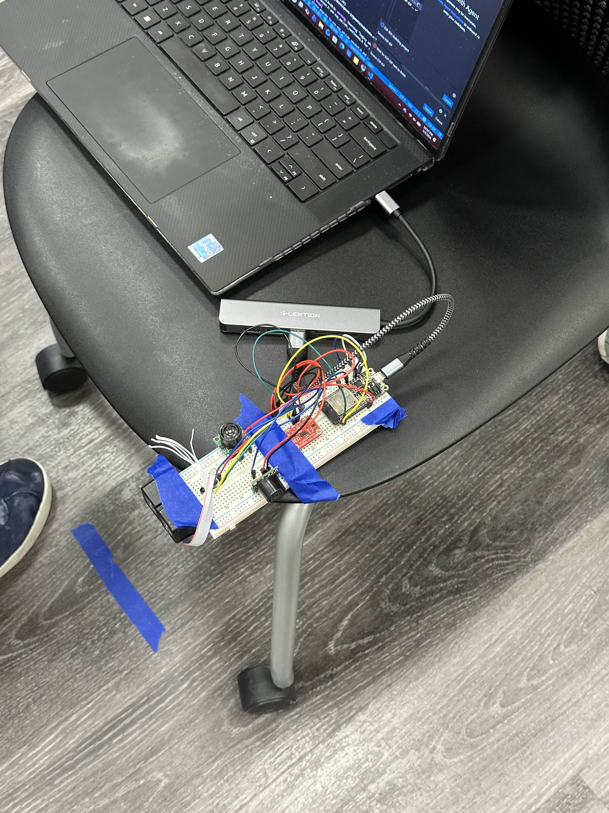
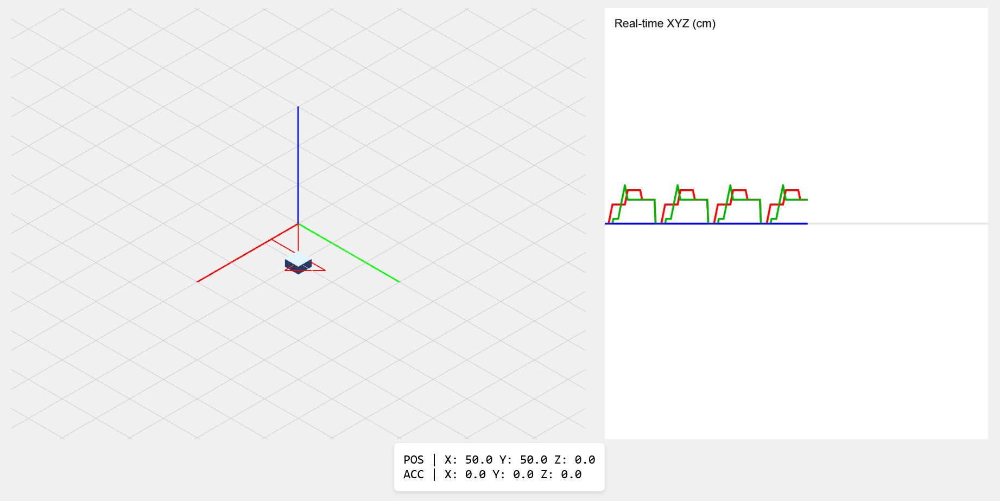
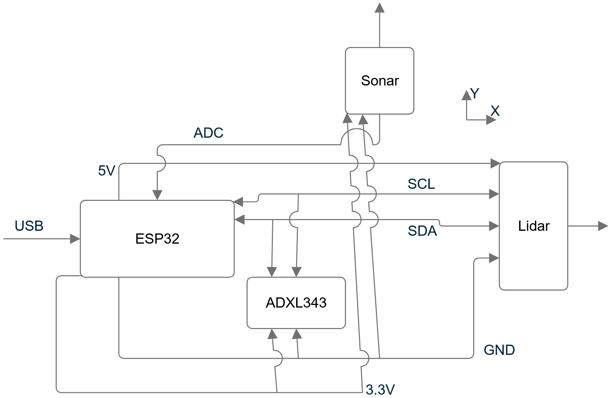

# Sensor Fusion Localization

Authors: Justin Nascimento, Alvin Yan

Date: 2026-03-05

### Summary

In this quest, we needed to integrate an accelerometer and distance sensors to achieve sensor fusion localization. We initially chose to use an Analog Devices ADXL343, a Garmin Lidar Lite V4, and two MaxBotix LV MaxSonar EZ's, but opted to just use one Lidar and one Sonar in the end (more detail below).

Based on the sensor readings (i.e., acceleration and distance), the device needs to figure out how far and in what directions it moved relative to its origin, or a "ground truth."

The ESP32 processes the acceleration and distance data through a series of filters and calculations, compiling and sending this data through the serial port to be picked up by a host computer, which will handle the visualization.

### Solution Design

Our solution design is fairly straightforward. We are only using the ESP32, the accelerometer, the Lidar, and two sonars. The Lidar is aligned with the accelerometer's X-axis, and one sonar for the Y- and Z-axes each. The accelerometer and the sonars attach to the breadboard securely, while the Lidar is taped to the end of the breadboard. 

In order to decrease the chance of any unwanted movements (i.e., arms shaking) to the device, we taped our device down to a chair to move it on a stable platform. See photo of design below.

Our sensor fusion device taped to a chair

As for our visualization tool, we used a node.JS server to host the webpage where visualization happens. The node.JS server reads serial data from the ESP32 in a .csv format as follows:

- [xa, ya, za, xd, yd, zd]
- "a" denotes acceleration and "d" denotes distance/position

The node.JS sends this data to the visuals.js file, where the p5.JS API processes this data for displaying 3D movement tracking and position graghs. 

See UI below.

Visualization UI with sample movement data

Below is our wiring diagram.

Lidar and Sonar aligns with accelerometer X and Y.

### Quest Summary
In our initial design, we planned to use one distance sensor for each axis, mapping Lidar to X, and two Sonars for Y and Z. In our testing, we found the Lidar to be very accurate and to work wonderfully in conjunction with the accelerometer, but the Sonars provided very poor readings. Further testing revealed that when using both Sonars at the same time, data processing slowed down severely (down to less than 10 Hz) and impacted the accuracy of sensor fusion calculations. 

We decided to remove the Sonar operating in the Z-axis, therefore improving the sampling rate of the system as a whole. Doing this also drastically improved localization accuracy, with movements being measured within 5% of actual values (as seen in the technical demo).

In our accelerometer only double integration test after applying our filters, we found that some movements were somewhat accurately conveyed, but the model still tends to drift off. As for the phone accelerometer data, we found that it was very noisy, and trying to derive position from this data was orders of magnitudes worse than our dedicated accelerometer unit, even with all the same filtering applied.

If we were to do this project again, we would implement better filters (i.e., Kalman filter, etc.) to give us even cleaner data to work with, and we can improve the 3D visualization to follow the movements instead of being a fixed camera angle. We believe these changes will not only improve our accuracy further, but also provide quality of life for the viewer.

### Investigative Questions
We observed a few patterns in the noise; first, we noticed that the acceleration data had an offset value that needed to be modified in every direction, and that the accelerometer readings oscillated within a certain precision range, even when sitting still. This range seemed to grow more based on the speed of the accelerometer; faster speeds lead to more noise.

In order to fix these scenarios, there are a few things one can do (some of which we even did). First, to prevent an offset value from causing the sensor to drift, the code can calibrate the sensor. In the accelerometer's case, this meant letting the accelerometer sit still at the start for a few readings and record the average acceleration value in all three cardinal directions. Since we know the accelerometer is still (meaning all the acceleration values should be zero), we can save the average acceleration recorded in each direction as the offset and subtract it from all future recordings, eliminating the sensor's internal offset. Furthermore, there are many ways to remove the noise associated with higher error speeds. First would be to do what we did: use a more accurate sensor to record the distance traveled (like a LIDAR or ultrasonic sensor) and use the change in distance that is recorded as the distance value. 

Another potential way to correct this noise would be to increase the frequency at which you record accelerometer data. Since acceleration is continuous yet the data points we collect are discrete, we need to esimate the shape between the readings to get values between the collected data points, turning our discrete set continuous. By increasing the frequency of data collection, we can allow the sensor to catch rapid changes in the data and decrease the error from approximating the shape of the curve between data points, giving us more accurate data. 

### Supporting Artifacts
- [Link to video technical presentation](https://youtu.be/9qwb9Yu2erA).
- [Link to video demo](https://youtu.be/NPXk-dmznB8).

### Self-Assessment 

| Objective Criterion | Rating | Max Value  | 
|---------------------------------------------|:-----------:|:---------:|
| Objective One     |  1  |  1     | 
| Objective Two     |  1  |  1     | 
| Objective Three   |  1  |  1     | 
| Objective Four    |  1  |  1     | 
| Objective Five    |  1  |  1     | 
| Objective Six     |  1  |  1     | 
| Objective Seven   |  1  |  1     | 

### AI and Open Source Code Assertions

- We have documented in our code readme.md and in our code any software that we have adopted from elsewhere
- We used AI for coding and this is documented in our code as indicated by comments "AI generated" 

