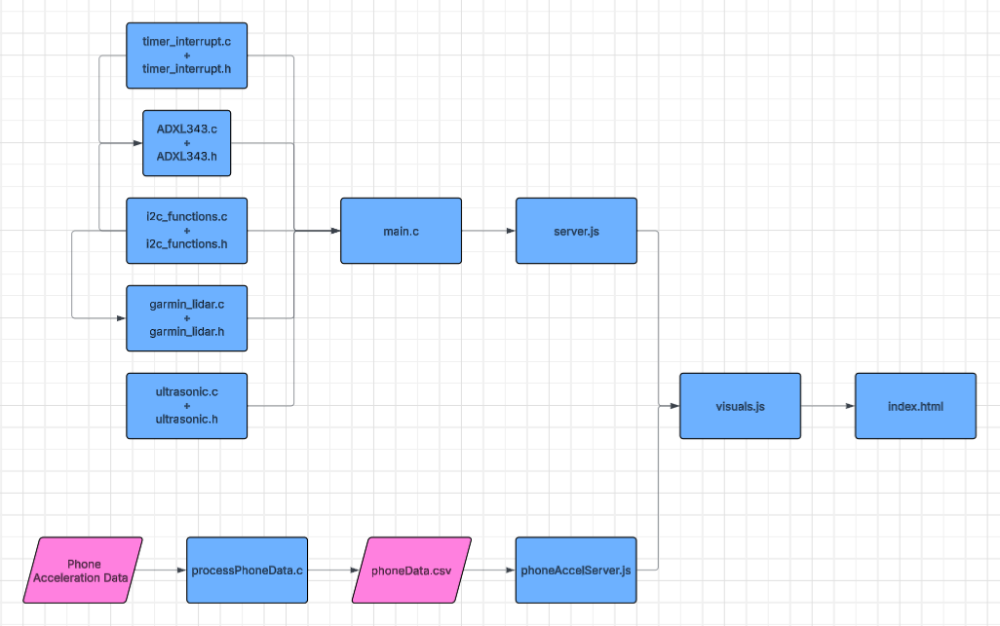

# Code Readme

<p align="center">

</p>
<p align="center">
File Structure Diagram
</p>

## File Structure

### Within the "visualization" Folder:

The visualization portion of the project consists of three primary components: a Node.js backend server, a p5.js based frontend visualizer, and a data-source layer. These components work together to provide real-time 3D spatial tracking and 2D sensor trend analysis.

```server.js```: This file acts as the central hub for data communication. Built on Node.js and Express, it initializes a WebSocket server to broadcast sensor data to the browser. It includes logic to read from either a hardware serial port (COM8) or a persistent data.csv file, streaming telemetry packets at a fixed 0.1s interval to simulate real-time operation.

```phoneAccelServer.js```: This file performs the same funciton as ```server.js```, with the exception that it takes .csv data instead of reading from the serial port.

```phoneData.csv```: Contains the pre-recorded or simulated telemetry data. Each row consists of six comma-separated values representing tri-axial acceleration (xa, ya, za) and tri-axial displacement (xd, yd, zd).

#### The "public" Folder:

```visuals.js```: This file contains the frontend logic and is split into two distinct p5.js instances:

    3D Visualizer (sketch3D): Manages a WEBGL environment that renders the object’s position in 3D space. It includes a persistent "breadcrumb" trail that tracks movement history, a static coordinate grid, and world-space axes for orientation.

    2D Graphing (sketchGraph): Processes the incoming stream to generate a rolling trend-line graph. It plots the X, Y, and Z coordinates simultaneously to help identify mechanical oscillations or linear drift.

```index.html```: Defines the user interface and dashboard layout. It provides the containers for the p5.js canvases and includes dynamic <div> elements for the textual display of raw position and acceleration data.

### The "esp32" Folder:
```ADXL343.c and ADXL343.h```: Contains the global variables, definitions, libraries, and functions needed to initialize, calibrate, filter, and collect data from the accelerometer.

```garmin_lidar.c and garmin_lidar.h```: Contains the global variables, definitions, libraries, and functions needed to initialize and collect data from the Garmin LiDAR v4.

```i2c_functions.c and i2c_functions.h```: Contains the global variables, definitions, libraries, and functions needed to initialize and communicate over I2C.

```timer_interrupt.c and timer_interrupt.h```: Contains the global variables, definitions, libraries, and functions needed to initialize the timers and their hardware interrupts.

```ultrasonic.c and ultrasonic.h```: Contains the global variables, definitions, libraries, and functions needed to initialize and collect data from the Ultrasonic sensor on the ADC pin.

```main.c```: This file uses all the files mentioned above as libraries to initialize I2C communication, to initialize all the sensors, to initialize a timer, and spin an RTOS task to either perform double integration or sensor fusion to collect the distance moved. It then sends the acceleration and distance over serial for the node.js server to use.

### processPhoneData.c:
```processPhoneData.c```: This file uses the acceleration data collected from our smartphone's accelerometer, performs double integration with filtering to calculate the distance travelled, and stores the data in a CSV for the node.js server to use.

```x.txt, y.txt, z.txt```: These are the raw axial data from the phone accelerometer app. 


## AI Declaration
- ChatGPT and Gemini was used sparingly for bug fixes and logic simplification.
